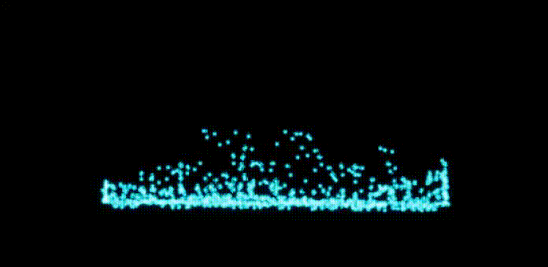

# UE4NiagaraSandbox

The asssets from UE4 third person template are under the liscense of EPIC Games.

## SPH_2D_CPU_Map
SPH 2D CPU Implementation.
Doing simulation by my C++ program, Graphic by Niagara.
Implemented the feature like NeighborGrid3D by C++.

## SPH_2D_GPU_Map
SPH 2D GPU Implementation.
Doing booth simulation and graphic by Niagara.

## SPH_3D_CPU_Map
SPH 3D CPU Implementation.
Doing simulation by my C++ program, Graphic by Niagara.
Implemented the feature like NeighborGrid3D by C++.

## SPH_3D_GPU_Map
SPH 3D GPU Implementation.
Dogin both simulation and graphic by Niagara.

## SPH_3D_GPU_Demo_Map
Visualized SPH 3D by SSFR(screen space fluid rendering).
Doing simulation and SSFR by Niagara.
The shading model of the material is SingleLayerWater so it needs Water plugin enabled.

