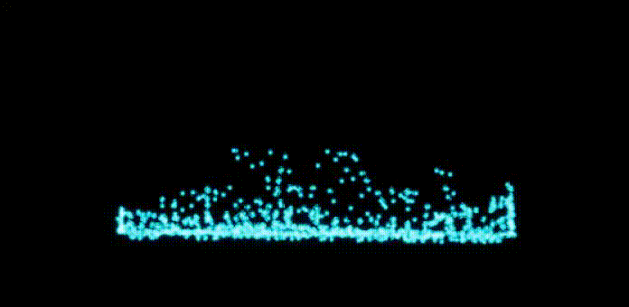

# UE4NiagaraSandbox

The asssets from UE4 third person template are under the liscense of EPIC Games.

## SPH_2D_CPU_Map
SPH CPU Implementation.
Simulation by my C++ program, Graphic by Niagara.
Implemented the feature like NeighborGrid3D by C++.

## SPH_2D_GPU)Map
SPH GPU Implementation.
Both simulation and graphic by Niagara.

